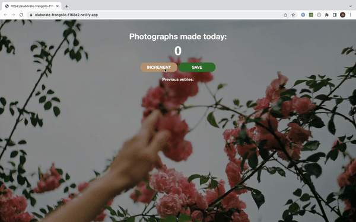

# Photo counter

Photo counter is a web page that users can use to count and save the number of photographs that they made.

## Features
Users have two buttons: one that increments the number, and the other that saves it and shows it on the screen along with the previous saves. After saving the number is set back to 0.

## Demo
 

or test it on Netlify: https://elaborate-frangollo-f168e2.netlify.app/ 

## Technologies
The project is built using:
* HTML
* CSS
* JavaScript

## Sources
The core of this project was built during the class on [the Frontend Developer Career Path at Scrimba](https://scrimba.com/learn/frontend) and later edited by me.

## Project status
The project is complete.

## Contact
Created by [Natalia Davtyan](https://github.com/nataliadavtyan)
